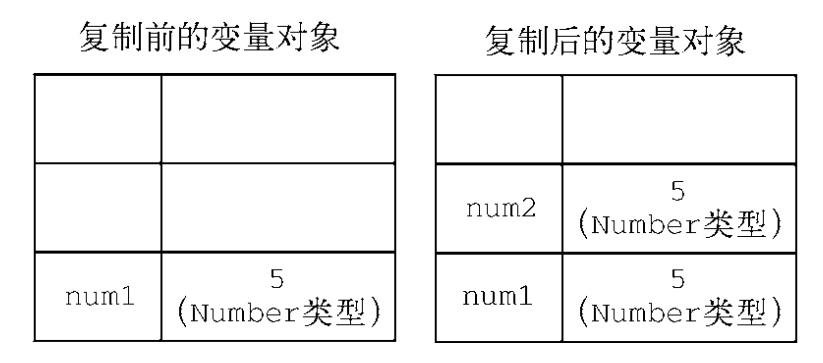
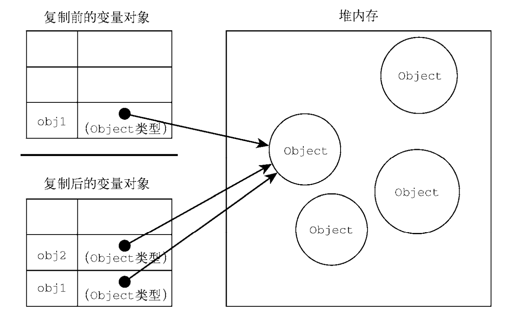

# 第二章

## 推迟脚本执行

> defer 会在页面全部解析完毕之后再执行

```HTML
<!DOCTYPE html>
<html>
<head>
    <title>Example HTML Page</title>
    <script defer src="example1.js"></script>
    <script defer src="example2.js"></script>
</head>
<body>
<!-- 这里是页面内容 -->
</body>
</html>
```

# 第三章 语言基础

## 关键字与保留字

> break do in typeof
> case else instanceof var
> catch export new void
> class extends return while
> const finally super with
> continue for switch yield
> debugger function this
> default if throw
> delete import try

## 1. 变量

var声明和let声明的区别
var声明作用于整个函数,let作用域块

### 全局变量

使用 let 在全局作用域中声明的变量不会成为 window 对象的属性（var 声
明的变量则会）。

## 2. 数据类型

六种数据类型
Undefined、Null、Boolean、Number、String 和 Symbol 复杂数据类型(Object)

### typeof 操作符

"undefined"表示值未定义；     
"boolean"表示值为布尔值；      
"string"表示值为字符串；         
"number"表示值为数值；            
"object"表示值为对象（而不是函数）或 null；     
"function"表示值为函数；         
"symbol"表示值为符号。

```javascript
 let message = "some string";
console.log(typeof message); // "string" 
console.log(typeof (message)); // "string" 
```

### Null类型

### Boolean 类型

强制将变量转换为布尔类型`console.log(Boolean(message))`

### Number 类型

- 八进制前面加0 ,十六进制前面加0x

 ```
  
  let floatNum1 = 1.1;           
  let floatNum2 = 0.1;           
  let floatNum3 = .1; // 有效，但不推荐 
     
  let floatNum1 = 1.; // 小数点后面没有数字，当成整数 1 处理
  let floatNum2 = 10.0; // 小数点后面是零，当成整数 10 处理
 //浮点值可以用科学记数法
  let floatNum = 3.125e7; // 等于 31250000
 ```

- 值的范围    
  最小值 Number.MIN_VALUE       
  最大值 Number.MAX_VALUE        
  超出的值会表示为无穷值 Infinity    
  超出最小值 -Infinity

 ```javascript
 //   判断一个值是否在最大值,最小值之间      
let result = Number.MAX_VALUE + Number.MAX_VALUE;
console.log(isFinite(result)); // false 
```

- NaN   
  不是数值
  ```javascript 
  console.log(isNaN(NaN)); // true 
  console.log(isNaN(10)); // false，10 是数值

``console.log(isNaN("10")); // false，可以转换为数值 10 `
console.log(isNaN("blue")); // true，不可以转换为数值
console.log(isNaN(true)); // false，可以转换为数值 1

- 数值转换

> 有3个函数可以将非数值转换为数值
**Number()、parseInt()和 parseFloat()**

### String类型

| 字符     | 字面量                                                             |
|--------|-----------------------------------------------------------------|
| 字 面    | 量 含 义                                                           |
| \n     | 换行                                                              |
| \t     | 制表                                                              |
| \b     | 退格                                                              |
| \r     | 回车                                                              |
| \f     | 换页                                                              |
| \\     | 反斜杠（\）                                                          |
| \'     | 单引号（'），在字符串以单引号标示时使用，例如'He said, \'hey.\''                      |
| \"     | 双引号（"），在字符串以双引号标示时使用，例如"He said, \"hey.\""                      |
| \`     | 反引号（`），在字符串以反引号标示时使用，例如`He said, \`hey.\``                      |
| \xnn   | 以十六进制编码 nn 表示的字符（其中 n 是十六进制数字 0~F），例如\x41 等于"A"                 |
| \unnnn | 以十六进制编码 nnnn 表示的 Unicode 字符（其中 n 是十六进制数字 0~F），例如\u03a3 等于希腊字符"Σ |                                                              |

- 转换为字符串

> 有两种方式把一个值转换为字符串。首先是使用几乎所有值都有的 toString()方法。这个方法唯
> 一的用途就是返回当前值的字符串等价物。
> **null 和 undefined 值没有 toString()方法**
> toString()可以传递一个参数,将它转换为进制数

```javascript
//转换为字符串
let age = 11;
let ageAsString = age.toString();//字符串11
console.log(typeof ageAsString)
let found = true;
let foundAsString = found.toString();//字符串true
console.log(foundAsString)
let num = 888;
console.log(num.toString(8))//1570
```

> 如果你不确定一个值是不是 null 或 undefined，可以使用 String()转型函数

```javascript
let a = null;
console.log(String(a))//输出字符串null
```

- 模板字面量

> 可以保留换行字符串

```javascript
//模板字面量
let myTemplateLiteral = `first line
                           second line`
console.log(myTemplateLiteral)
//模板字面量会保留换行符
let myMultipleLineString = `first line \nsecond line`
console.log(myMultipleLineString)
```

字符串插值
**字符串插值通过在${}中使用一个 JavaScript 表达式实现**
> 剩余操作符,收集剩余参数,用...即可
> 字面量标签函数,第一个参数收集的是变量周围的字符,第二参数开始才是被传递的参数

```
function simpleTag(strings, ...expression) {
console.log(strings)//['', ' + ', ' = ', '', raw: Array(4)]
console.log(expression)//[6, 9, 15]
}
simpleTag`${ba} + ${bc} = ${ba + bc}`
```

- 原始字符串

> 默认情况下呢,字面量会转换unicode,我们不想转换它可以用
> String.raw,让它不转换

```javascript
    //原始字符串
    //Unicode示例
console.log(`\u00a9`)// ©
console.log(String.raw`\u00A9`); // \u00A9
```

## Symbol类型

## Object类型

每个Object实例都有下面的属性和方法
constructor:  
hasOwnProperty(propertyName)：  
isPrototypeOf(object)：  
propertyIsEnumerable(propertyName)：  
toLocaleString()：  
toString()：  
valueOf()：

### 位操作符

与,或,非,左移,右移,有符号右移,无符号右移

### 布尔操作符

逻辑非(!)  
逻辑与(&&)  
逻辑或(||)

```javascript
console.log(!false); // true 
console.log(!!"blue"); // 转换成布尔值,true
```

取模操作符 %   
指数操作符 Math.pow(),**

```javascript
  console.log(Math.pow(3, 2)); // 9 
console.log(3 ** 2); // 9
```

### 关系操作符

> 关系操作符执行比较两个值的操作，包括小于（<）、大于（>）、小于等于（<=）和大于等于（>=）

## 语句

if  
do while  
while  
for in 枚举对象中的非符号键属性
for of  
for   
with语句  
标签语句
> 标签语句用于调整到标签处

```javascript
var num = 0;
outermost:
    for (let i = 0; i < 10; i++) {
        for (let j = 0; j < 10; j++) {
            if (i == 5 && j == 5) {
                break outermost;
            }
            num++;
        }
    }
console.log(num)
```

with 语句

```javascript
with (location) {
    let qs = search.substring(1);
    let hostName = hostname;
    let url = href;
}
```

# 第 4 章 变量、作用域与内存

## 复制值


> 原始值和引用值的区别


```javascript
//原始值,num1和num2指向不同的内存空间
let num1 = 5;
let num2 = num1;//5

//引用值
// obj1和obj2指向同一个对象,一个修改,也会跟着另一个一起修改
let obj1 = new Object();
let obj2 = obj1;
obj1.name = "Nicholas";
console.log(obj2.name); // "Nicholas"

```

## 确定类型

typeof 判断是否为字符串,数值,布尔值,或undefined  
而instanceof 用来检测一个对象是否属于某个特定的构造函数的实例

```javascript
console.log(person instanceof Object); // 变量 person 是 Object 吗？
console.log(colors instanceof Array); // 变量 colors 是 Array 吗？
console.log(pattern instanceof RegExp); // 变量 pattern 是 RegExp 吗？
```


